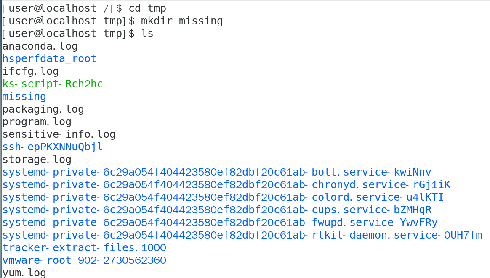
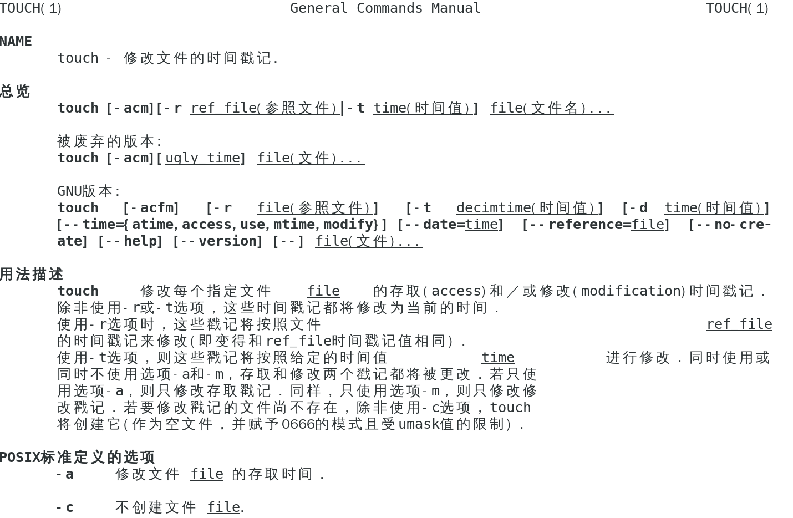
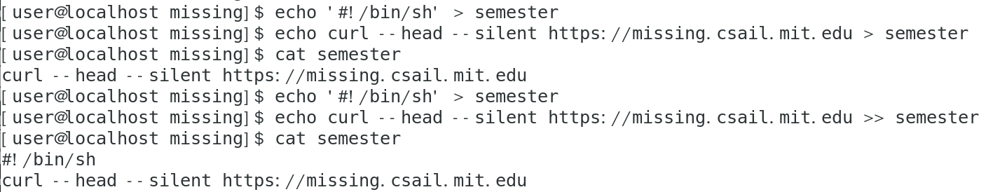
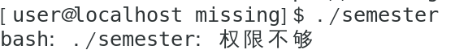
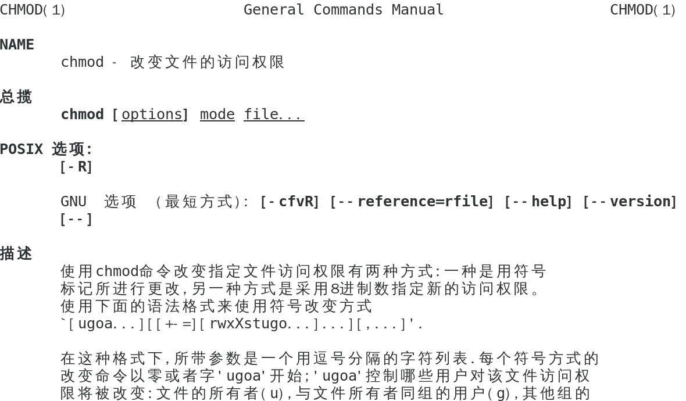
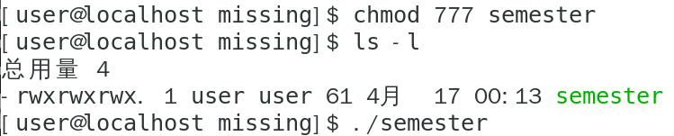

# The Shell 
## 课后练习
#### 1.在 /tmp 下新建一个名为 missing 的文件夹

#### 2.用 man 查看程序 touch 的使用手册

#### 3.用 touch 在 missing 文件夹中新建一个叫 semester 的文件

#### 4.将以下内容一行一行地写入 semester 文件

#### 5.尝试执行这个文件

#### 6.查看 chmod 的手册

#### 7.使用 chmod 命令改变权限，使 ./semester 能够成功执行

## 遇到的问题
#### 1. 删除已经创建的文件（如semester）
`rm semester`
#### 2.使用vim删除文件中写错的内容
` vim semester `
`i 键:插入模式
Esc 键:退出插入模式
:w 表示保存
:q 表示退出`
#### 3.使用 chmod 命令赋予执行权限
`chmod +x semester`
#### 4.移动文件
`mv test.txt /home/user/documents`（在当前目录）
`mv /home/user/downloads/test.txt /home/user/documents`（不在当前目录）