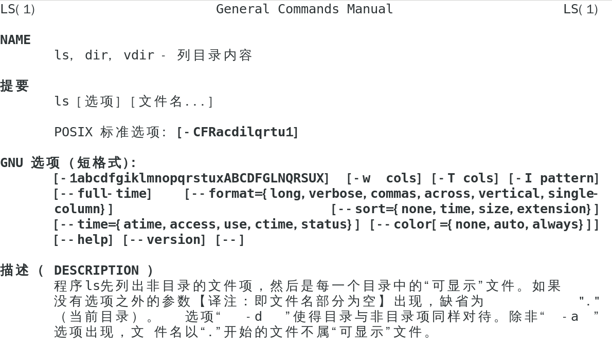
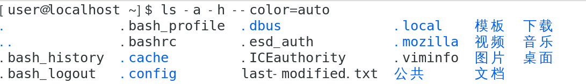
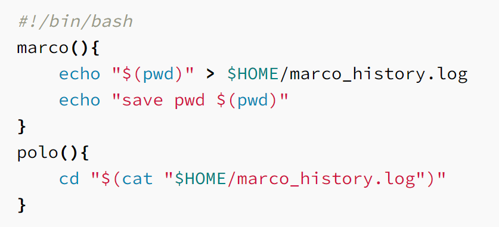
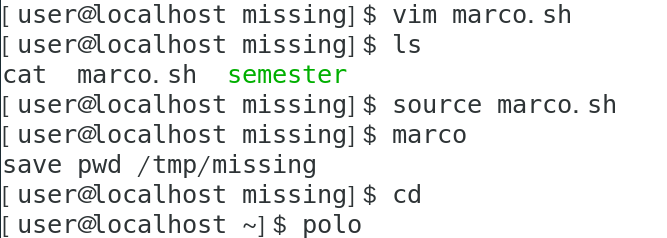
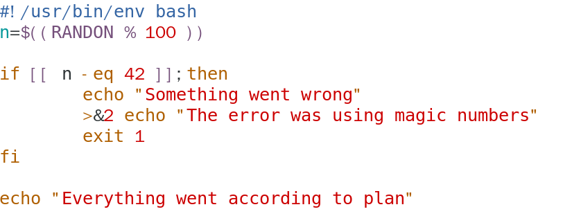
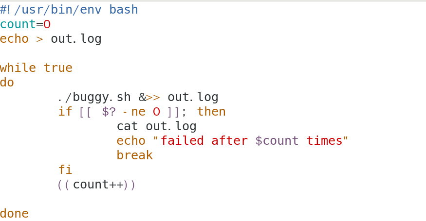
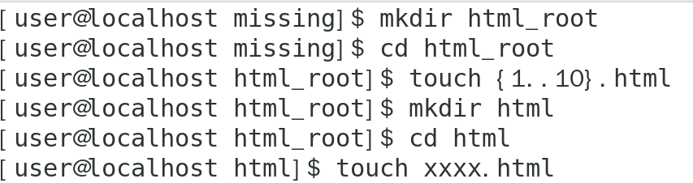
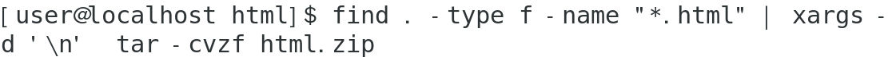
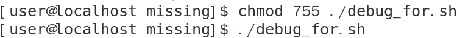

# Shell 工具与脚本
## 课后练习
#### 1.阅读 man ls 

然后使用 ls 命令进行如下操作
所有文件（包括隐藏文件）文件打印以人类可以理解的格式输出
文件以最近访问顺序排序
以彩色文本显示输出结果

#### 2.编写两个 bash 函数 marco 和 polo

#### 3.编写一段 bash 脚本，运行如下的脚本直到它出错，将它的标准输出和标准错误流记录到文件，并在最后输出所有内容，报告脚本在失败前共运行了多少次。

使用 while 循环完成

#### 4. find 命令
首先创建所需的文件

执行 find 命令

## 遇到的问题
#### 1. 权限不够
使用 chmod 命令赋予执行权限

#### 2.语法错误
修正
>#!/bin/bash
if [ $? -ne 0 ]; then
    echo ""
else
    echo ""
fi