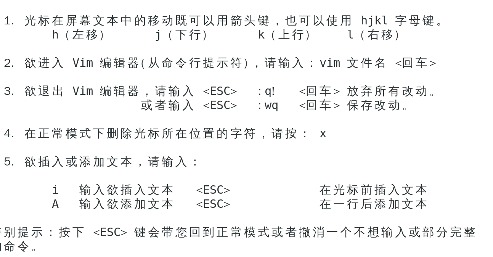
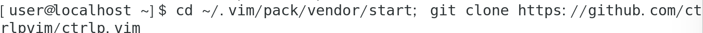
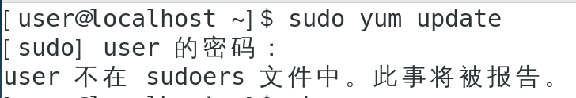
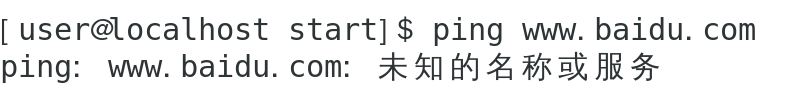
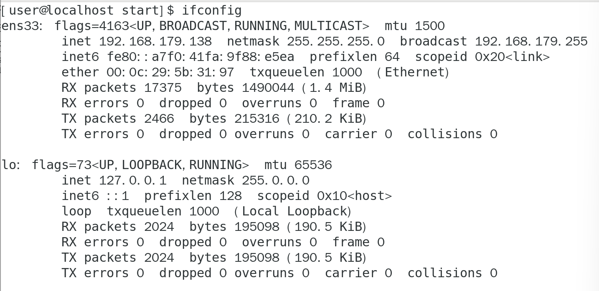
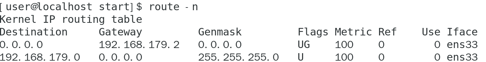
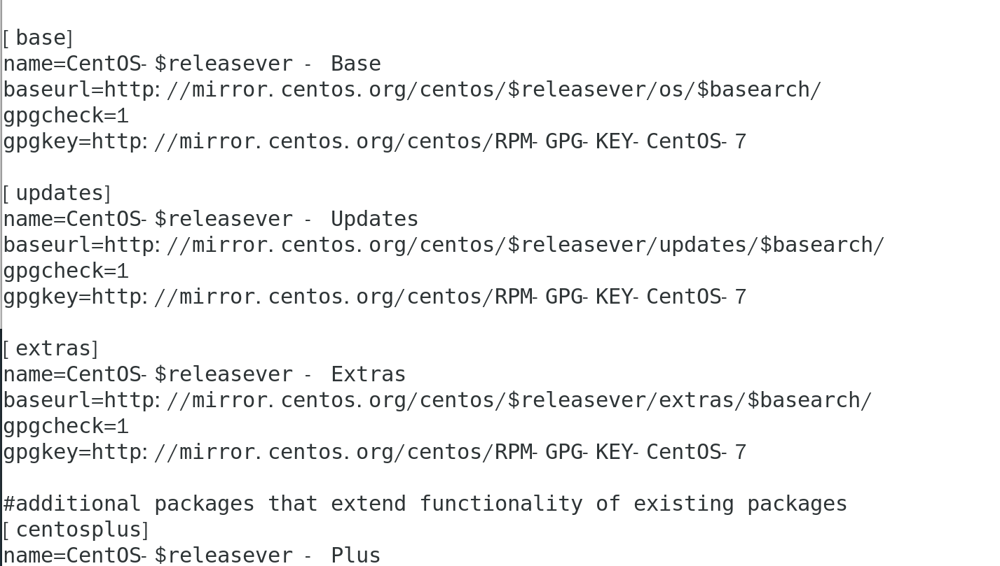
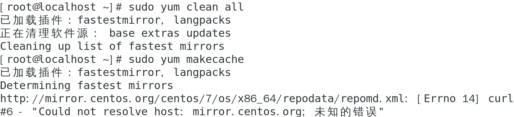
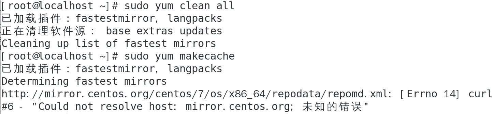

# Vim
## 课后练习
#### 1.完成 vimtutor 

##### 学习Vim

#### ...

#### 2.安装和配置一个插件： ctrlp.vim
##### 创建插件文件夹

##### 下载这个插件

## 遇到的问题
#### 1. 权限不够

##### 以 root 用户登录
`su - root`

### 2. cannot find a valid baseurl for repo:base/7/x86_64 
#### （1）网络连接问题  
- ##### 测试网络连通性: [错误]
  `ping www.baidu.com`
  

  
- ##### 查看网络配置
  - ##### ip: [无误]
    `ifconfig`

  - ##### 网关: [无误]
    `route -n`

#### （2）检查DNS设置
- ##### 更换 DNS 服务器：[测试失败]
   *编辑 /etc/resolv.conf文件；添加 nameserver 8.8.8.8   nameserver 114.114.114.114）*

#### （3）检查YUM仓库配置
- ##### 备份现有的YUM配置文件
  `sudo cp -r /etc/yum.repos.d /etc/yum.repos.d.backup`

- ##### 编辑或替换仓库配置文件 (Ctrl x  &nbsp;&nbsp;  M-B)
  `sudo nano /etc/yum.repos.d/CentOS-Base.repo`

- ##### 清理YUM缓存并重建缓存  &nbsp;[错误]
  `sudo yum clean all`
`sudo yum makecache`
`sudo yum update`

#### （4）配置阿里云镜像源
- ##### 编辑或替换仓库配置文件
  `sudo nano /etc/yum.repos.d/CentOS-Base.repo`

- ##### 清理YUM缓存并重建缓存  &nbsp;[错误]
  
😵‍💫